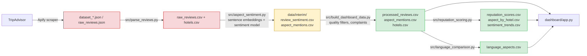

# Data Schema & Pipeline

## Pipeline flow

Red: raw scrape files, kept local and never published (raw exports may contain reviewer details).
Yellow: intermediate model output, local only (`data/interim/`, gitignored). Green: derived tables published under
`dashboard/data/`. They contain review text and hotel names, but no reviewer names, profile links or locations.

## Tables in `dashboard/data/`

### `processed_reviews.csv` - one row per review
| Column | Description |
|---|---|
| `review_id`, `hotel_id`, `hotel_name`, `city` | Identifiers |
| `review_text` | Cleaned review text (original language) |
| `rating` | 1-5 stars |
| `language` | Language the guest wrote in (`en`, `es`, ...), from `originalLanguage` |
| `trip_type` | FAMILY, COUPLES, FRIENDS, SOLO, BUSINESS |
| `published_date` | Review date |
| `sentiment_score` | 0 (negative) to 1 (positive): length-weighted mean of sentence scores |
| `sentiment_label` | negative / neutral / positive (cut at 0.4 and 0.6) |

### `aspect_mentions.csv` - one row per aspect-tagged sentence
| Column | Description |
|---|---|
| `review_id`, `hotel_id`, `hotel_name`, `city`, `language`, `published_date` | From the parent review |
| `aspect` | staff, room, location, cleanliness, food, amenities, price or noise |
| `sentence` | The sentence text |
| `score` | Sentence sentiment, 0-1 |
| `polarity` | pos / neu / neg (neutral unless the model is decisive) |
| `aspect_sim` | Cosine similarity to the aspect prototype (only >= 0.55 kept) |
| `p_pos`, `p_neg` | Sentiment model probabilities |
| `rating` | Star rating of the parent review |
| `is_complaint` | True if clearly negative in a review rated <= 3 stars, or overwhelmingly negative anywhere |

### `reputation_scores.csv` - one row per hotel
| Column | Description |
|---|---|
| `hotel_id`, `hotel_name`, `city` | Identifiers |
| `reputation_score` | 0-10, see [METHODOLOGY.md](METHODOLOGY.md#reputation-score-0-10) |
| `competitor_rank` | Rank within city, 1 = best |
| `avg_sentiment`, `avg_rating` | Means over the trailing 24 months |
| `review_count`, `en_count`, `es_count`, `other_count` | Reviews in the 24-month window |
| `reviews_analyzed_total` | All reviews analyzed for the hotel |
| `ta_review_count`, `ta_rating` | TripAdvisor's own total review count and rating |
| `recency_factor`, `volume_factor` | Score components (0-10) |
| `top_praise` | Up to 3 aspects with the highest share of positive mentions (min. 8 mentions) |
| `top_complaints` | Up to 3 aspects with 2+ complaint sentences |

### `aspect_by_hotel.csv` - one row per hotel x aspect
`hotel_id`, `hotel_name`, `city`, `aspect`, `mentions`, `mean_score`, `pct_positive`, `pct_negative`,
`negative_mentions`, `complaint_mentions`, `en_mentions`, `es_mentions`

### `sentiment_trends.csv` - one row per quarter x city x language
`quarter`, `city`, `language`, `avg_sentiment`, `review_count`

### `language_aspects.csv` - one row per aspect
| Column | Description |
|---|---|
| `aspect` | Aspect name |
| `en_share`, `es_share` | Share of each language's aspect comments on this aspect |
| `en_share_hotel_adjusted` | English share re-weighted to the Spanish hotel mix |
| `raw_diff`, `adjusted_diff` | Spanish minus English share, before / after the hotel adjustment |
| `ci_low`, `ci_high` | 95% bootstrap interval for `adjusted_diff` |
| `reliable` | Interval excludes zero |
| `evidence` | robust / suggestive / none, see [METHODOLOGY.md](METHODOLOGY.md#english-vs-spanish-comparison) |
| `hotels_same_direction`, `hotels_compared` | Direction consistency across hotels with 30+ Spanish tagged sentences |
| `en_reviews`, `es_reviews`, `en_tagged`, `es_tagged` | Sample sizes |

### `hotels.csv` - one row per hotel
`hotel_id`, `hotel_name`, `ta_review_count`, `ta_rating` (TripAdvisor's own totals at scrape time)
