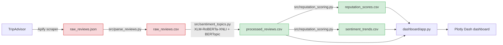

# Data Schema & Pipeline

## Pipeline Flow

Red nodes (`raw_reviews.json`, `raw_reviews.csv`) contain reviewer PII and live only in `/data/` —
gitignored, not published. Green nodes are PII-free derived data, committed under `/dashboard/data`.

## Table Schemas

### `data/raw_reviews.csv` (gitignored, local only)
| Column | Type | Description |
|---|---|---|
| `review_id` | string | TripAdvisor review ID |
| `hotel_id` | string | TripAdvisor location ID |
| `hotel_name` | string | Hotel name |
| `city` | string | Miami / Orlando |
| `review_text` | string | Cleaned review body |
| `rating` | int | 1-5 star rating |
| `language` | string | ISO language code (`en`, `es`, ...) |
| `trip_type` | string | e.g. FAMILY, COUPLES, FRIENDS |
| `published_date` | date | Review publish date |
| `source` | string | Always `tripadvisor` |

### `dashboard/data/processed_reviews.csv`
Adds sentiment and topic fields to the raw schema:

| Column | Type | Description |
|---|---|---|
| `review_id`, `hotel_id`, `hotel_name`, `city`, `review_text`, `rating`, `language`, `trip_type`, `published_date` | — | Same as raw schema |
| `sentiment_score` | float (0-1) | Zero-shot classifier confidence in top label |
| `sentiment_label` | string | `positive` / `negative` / `neutral` |
| `topic_id` | int | BERTopic cluster ID (`-1` = outlier, not clustered) |
| `topic_name` | string | Top keyword for the assigned topic |

### `dashboard/data/reputation_scores.csv`
One row per hotel:

| Column | Type | Description |
|---|---|---|
| `hotel_id` | string | TripAdvisor location ID |
| `hotel_name` | string | Hotel name |
| `city` | string | Miami / Orlando |
| `reputation_score` | float (0-10) | See formula in [METHODOLOGY.md](METHODOLOGY.md#reputation-score) |
| `competitor_rank` | int | Rank within city, 1 = best |
| `avg_sentiment` | float (0-1) | Mean `sentiment_score` across the hotel's reviews |
| `review_count` | int | Total reviews for this hotel |
| `en_count`, `es_count` | int | Review count by language |
| `top_complaints` | string | Top 3 topics among negative-sentiment reviews, `; `-joined |
| `top_praise` | string | Top 3 topics among positive-sentiment reviews, `; `-joined |

### `dashboard/data/sentiment_trends.csv`
One row per hotel-month:

| Column | Type | Description |
|---|---|---|
| `hotel_id` | string | TripAdvisor location ID |
| `month` | string | `YYYY-MM` |
| `avg_sentiment` | float (0-1) | Mean sentiment for that hotel-month |
| `review_count` | int | Reviews in that hotel-month |
| `trend_direction` | string | `up` / `down` / `flat` / `n/a` vs. prior month |
